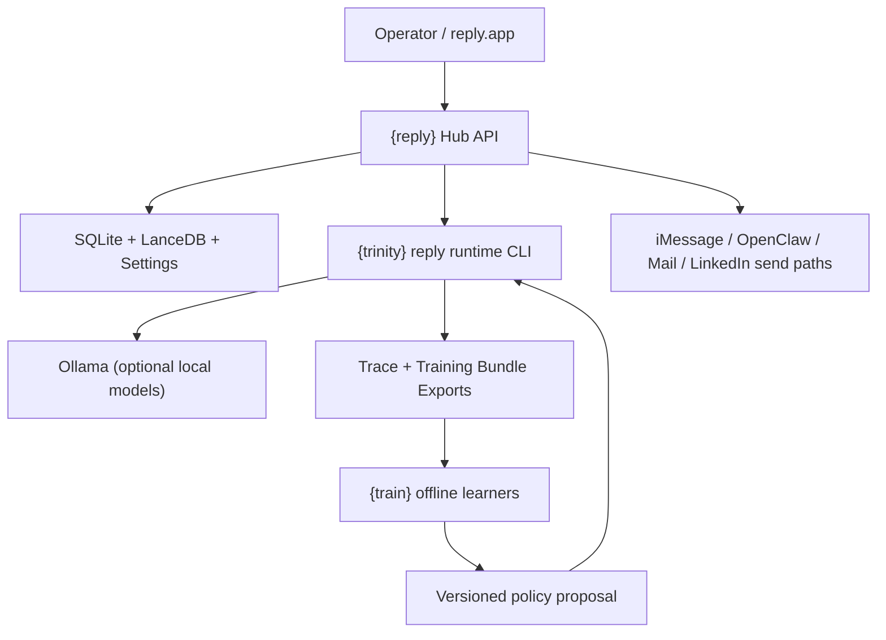

# System Architecture

## Overview

`{reply}` is now a local macOS product shell around three explicit layers:

1. `{reply}` product and transport layer
2. `{trinity}` live drafting runtime
3. `{train}` offline bounded learning loop

The important architectural rule is:

- `{reply}` does not own live drafting behavior anymore
- `{trinity}` does not own send semantics
- `{train}` does not mutate live behavior directly

## High-Level Diagram

## Product Responsibilities

### `{reply}` responsibilities

- channel ingestion and sync orchestration
- unified message storage
- conversation assembly and browsing
- contact/profile storage and enrichment
- operator workflow and native shell
- outbound execution
- human approval and transport safety rules
- structured outcome submission back to `{trinity}`

### `{trinity}` responsibilities

- thread snapshot intake
- candidate generation
- refinement
- evaluation and ranking
- behavior policy application
- cycle trace persistence
- training-bundle export

### `{train}` responsibilities

- bounded offline learning from exported bundles
- policy proposal generation
- incumbent-vs-candidate eval reporting
- artifact-level promotion inputs only

## `{reply}` Runtime Topology

### Native shell

- path: `app/reply-app`
- role: operator workspace and runtime control surface
- stack: SwiftUI / AppKit

### Node hub

- path: `chat/server.js`
- role: HTTP API, static UI, route coordination, worker supervision

### Product stores

- `~/Library/Application Support/reply/chat.db`
- `~/Library/Application Support/reply/contacts.db`
- `~/Library/Application Support/reply/settings.json`
- LanceDB under the same app-owned data root

### Drafting bridge

- path: `chat/brain-runtime.js`
- role:
  - build `ThreadSnapshot`
  - call `{trinity}` CLI commands
  - normalize result payloads
  - record structured outcomes
  - export traces

## Conversation Model

The product now treats conversations as message-backed first, contact-enriched second.

That means:

- dashboard source cards reflect ingestion totals
- the sidebar conversation list is built from the unified message corpus
- contact rows enrich labels, aliases, profile context, and visibility rules
- missing `contacts.db` rows must not hide valid message-backed threads

This prevents a small contact table from collapsing a much larger real inbox.

## Thread Loading Model

Thread loading is now intentionally bidirectional and UI-safe.

Current behavior:

- initial thread load requests:
  - the oldest 20 messages
  - the newest 20 messages
- if the thread is short, those windows collapse naturally into one thread
- if the thread is long, the middle remains as a gap that is filled progressively
- additional history is loaded in the background while preserving scroll position instead of blocking the app

Message rendering rules:

- sent messages render on the right
- received messages render on the left
- the thread uses explicit row alignment plus channel-specific bubble styling
- `is_from_me` is treated as authoritative where present; vector hints are fallback only

## Drafting and Outcome Flow

### Suggest path

1. `{reply}` assembles a `ThreadSnapshot`
2. `{reply}` calls `{trinity}` `reply-suggest`
3. `{trinity}` returns a ranked draft set and accepted artifact provenance
4. `{reply}` renders the selected draft and stores runtime context for later outcome submission

### Outcome path

1. operator sends, edits, ignores, or replaces a draft
2. `{reply}` builds a bounded `DraftOutcomeEvent`
3. `{reply}` submits it to `/api/trinity/outcome`
4. `{trinity}` records outcome state and can export replay/training artifacts

### Generic feedback path

Freeform notes and operator logs stay separate from structured drafting outcomes:

- `/api/trinity/outcome` for structured draft semantics
- `/api/feedback` and `/api/feedback/log` for generic notes/logging

## Failure Model

Normal UI surfaces should never expose raw substrate internals.

Runtime failures are classified into product-safe categories such as:

- `local_sandbox_unavailable`
- `trinity_runtime_unavailable`
- `openclaw_unavailable`
- `local_model_runtime_unavailable`

Raw socket paths, Docker daemon errors, and Colima-specific substrate text remain log-only diagnostics.

Native protected-route rule:

- sync actions from `reply.app` must send the same approval-bearing protected request shape as the web UI
- background sync routes should acknowledge `started`, not pretend the sync is already complete

## Native App Direction

Current product direction is stable:

- `reply.app` is the primary operator shell
- web-served UI remains as a local runtime surface, not the long-term product identity
- core workflows should stay inside the native shell through app chrome, panels, and dialogs

## Related Docs

- [README.md](/Users/Shared/Projects/reply/README.md)
- [LOCAL_MACHINE_DEPLOYMENT.md](/Users/Shared/Projects/reply/docs/LOCAL_MACHINE_DEPLOYMENT.md)
- [TRINITY_INTEGRATION_SPINE.md](/Users/Shared/Projects/reply/docs/TRINITY_INTEGRATION_SPINE.md)
- [POLICY_LOOP_REPO_BREAKDOWN.md](/Users/Shared/Projects/reply/docs/POLICY_LOOP_REPO_BREAKDOWN.md)
