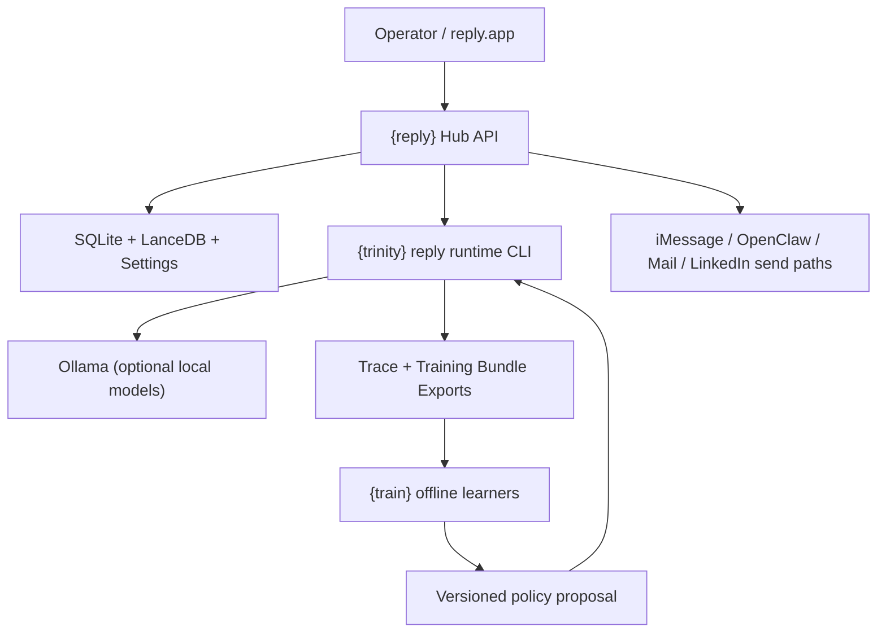

# System Architecture

## Overview

`{reply}` is now a local macOS product shell around three explicit layers:

1. `{reply}` product and transport layer
2. `{trinity}` live drafting runtime
3. `{train}` offline bounded learning loop

The important architectural rule is:

- `{reply}` does not own live drafting behavior anymore
- `{trinity}` does not own send semantics
- `{train}` does not mutate live behavior directly

The important delivery rule is:

- passive UI surfaces must read precomputed local state
- heavy joins, vector scans, ranking, and context assembly belong in local background workers
- online push/export happens after local state is already usable

The important identity rule is:

- contact merge and unmerge are explicit user actions
- the system must not auto-merge identities through heuristics

The important modeling rules are:

- normalize multi-channel message events into one stable internal vocabulary early
- keep local materialized read models authoritative for passive UI
- separate identity records from conversation and context projections
- treat operator review outcomes as first-class runtime state transitions
- keep draft decisioning separate from transport execution

## High-Level Diagram

```mermaid
graph TD
    User["Operator / reply.app"] --> Hub["{reply} Hub API"]
    Hub --> Stores["SQLite + LanceDB + Settings"]
    Hub --> Trinity["{trinity} reply runtime CLI"]
    Trinity --> Ollama["Ollama (optional local models)"]
    Trinity --> Exports["Trace + Training Bundle Exports"]
    Exports --> Train["{train} offline learners"]
    Train --> Policy["Versioned policy proposal"]
    Policy --> Trinity
    Hub --> Transport["iMessage / OpenClaw / Mail / LinkedIn send paths"]
```

## Product Responsibilities

### `{reply}` responsibilities

- channel ingestion and sync orchestration
- unified message storage
- conversation assembly and browsing
- contact/profile storage and enrichment
- operator workflow and native shell
- outbound execution
- human approval and transport safety rules
- structured outcome submission back to `{trinity}`
- company, cycle, and provenance preservation across operator flows

### `{trinity}` responsibilities

- thread snapshot intake
- candidate generation
- refinement
- evaluation and ranking
- behavior policy application
- cycle trace persistence
- training-bundle export
- accepted artifact provenance

### `{train}` responsibilities

- bounded offline learning from exported bundles
- policy proposal generation
- incumbent-vs-candidate eval reporting
- artifact-level promotion inputs only

## `{reply}` Runtime Topology

### Native shell

- path: `app/reply-app`
- role: operator workspace and runtime control surface
- stack: SwiftUI / AppKit

### Node hub

- path: `chat/server.js`
- role: HTTP API, static UI, route coordination, worker supervision

### Product stores

- `~/Library/Application Support/reply/chat.db`
- `~/Library/Application Support/reply/contacts.db`
- `~/Library/Application Support/reply/settings.json`
- LanceDB under the same app-owned data root

Conversation data is currently split across two local stores:

- `unified_messages` in `chat.db` as canonical message truth
- `conversation_index` in `chat.db` as the materialized sidebar browse model
- LanceDB `documents` for search, annotation, and remaining compatibility history paths

This is still transitional debt, but the browse path is now stricter than before.

Target state:

- `chat.db` owns the canonical conversation read models for passive browsing
- LanceDB supports search, annotation, and explicit drafting preparation
- passive workspace loading must not depend on LanceDB fallback or request-time reconstruction

### Drafting bridge

- path: `chat/brain-runtime.js`
- role:
  - build `ThreadSnapshot`
  - call `{trinity}` CLI commands
  - normalize result payloads
  - record structured outcomes
  - export traces
  - bound `{trinity}` calls, recover prepared drafts when possible, and only then fall back to local drafting when `suggest` stalls or fails
  - include bounded recent-learning summaries from the reply-owned local learning store in snapshot metadata

### Selected-thread hot cache

- path: `chat/thread-hot-cache.js`
- routes:
  - `GET /api/thread`
  - `GET /api/thread-delta`

Current rule:

- the hub may keep a bounded hot cache for recently visible threads
- `/api/thread` seeds that cache from canonical SQLite reads
- `/api/thread-delta` reads only messages newer than the current cursor when possible
- the cache is disposable acceleration only; canonical timeline truth remains in SQLite-backed message stores

### Bridge outbox and replay

- path: `chat/channel-bridge.js`
- primary route: `POST /api/channel-bridge/inbound`
- replay owner: `chat/background-worker.js`

Current rule:

- bridge-side inbound normalization and vector ingest should not block on long `chat.db` write contention
- unified message persistence is attempted with a bounded timeout
- durable `chat.db` writes are serialized before post-save maintenance runs
- if the write window is busy, the message is queued in `channel_bridge_pending.json`
- the background worker replays queued bridge writes under its own `channel_bridge_outbox` lock
- replay first reconciles against `unified_messages` so already-persisted rows are removed instead of retried forever

### Relation health contract

- path: `chat/routes/system.js`
- role:
  - expose `/api/health`, `/api/system-health`, and `/api/system/health`
  - report causal relation state instead of coarse service booleans

Current rule:

- each major relation should report:
  - active mode
  - last success
  - last failure
  - failure class
  - recovery state
- stale historical errors should not outrank fresh recovery evidence in the active relation view

## Conversation Model

The product now treats conversations as message-backed first, contact-enriched second.

That means:

- dashboard source cards reflect ingestion totals
- the sidebar conversation list is now read from the materialized `conversation_index` table in `chat.db`
- the conversation index is maintained locally from canonical message writes instead of being rebuilt in the request path
- contact rows enrich labels, aliases, profile context, and visibility rules
- missing `contacts.db` rows must not hide valid message-backed threads
- contact merge state is manual-only and user-owned; conversation expansion may use explicit aliases, never silent heuristic merges

This prevents a small contact table from collapsing a much larger real inbox.

It also keeps fallback mail conversations visible when Gmail is unavailable and Apple Mail is the active local source.

Thread loading still has some transitional compatibility logic, but the intended architecture is stricter:

- ingestion writes canonical message rows
- workers and canonical message writes maintain `conversation_index`, prepared draft context snapshots, and prepared golden-example artifacts
- UI routes page those local read models directly

This remains transitional and is no longer the target long-range foundation.

Target foundation direction:

- `external_threads` represent provider-native thread lineage
- `conversation_snapshots` represent immutable `{reply}` conversation blocks with frozen participant membership
- `conversation_participants` freeze membership for a snapshot
- `conversation_messages` and `message_recipients` store canonical ordered timeline truth
- `conversation_channel_capabilities` determine whether `{reply}` may reply or start on a channel

Membership rule:

- if membership changes, `{reply}` opens a new conversation snapshot even if the provider-native thread id stays the same
- participant change and contact merge are separate concepts; membership changes do not authorize automatic identity collapse

See [CONVERSATION_FOUNDATION_AUDIT.md](/Users/Shared/Projects/reply/docs/CONVERSATION_FOUNDATION_AUDIT.md).

## Thread Loading Model

Thread loading is now intentionally bidirectional and UI-safe.

Current behavior:

- initial thread load requests:
  - the oldest 20 messages
  - the newest 20 messages
- if the thread is short, those windows collapse naturally into one thread
- if the thread is long, the middle remains as a gap that is filled progressively
- additional history is loaded in the background while preserving scroll position instead of blocking the app

Message rendering rules:

- sent messages render on the right
- received messages render on the left
- the thread uses explicit row alignment plus channel-specific bubble styling
- `is_from_me` is treated as authoritative where present; vector hints are fallback only

Current browse-path boundary:

- `/api/thread` reads canonical conversation rows from `conversation_messages` first
- if canonical rows are unexpectedly absent for a handle, the route retries `rebuildConversationFoundation(...)` before using the legacy `unified_messages` compatibility path
- request-time LanceDB history recovery is removed from the passive thread route
- request-time WhatsApp LID expansion is removed from the passive thread route

Current compose-path boundary:

- web and native composers only expose channels from `conversation_channel_capabilities`
- send requests now carry `conversationId`
- send routes reject stale `conversationId` values and channels not allowed for the active conversation snapshot

## Drafting and Outcome Flow

### Suggest path

1. `{reply}` assembles a `ThreadSnapshot`
2. `{reply}` calls `{trinity}` `suggest --adapter reply`
3. `{trinity}` returns a ranked draft set and accepted artifact provenance
4. if live `suggest` fails but a prepared draft is already available, `{reply}` recovers the prepared Trinity draft
5. otherwise `{reply}` falls back to bounded local drafting
6. `{reply}` renders the selected draft and stores runtime context for later outcome submission

### Outcome path

1. operator sends, edits, ignores, or replaces a draft
2. `{reply}` builds a bounded `DraftOutcomeEvent`
3. `{reply}` submits it to `/api/trinity/outcome`
4. `{trinity}` records outcome state and can export replay/training artifacts

### Architectural lessons now enforced

- early normalization matters more than late adapter cleanup
- the local database is the workspace truth; sync and AI are downstream
- identity merge authority is separate from conversation projection authority
- every draft lifecycle transition must be attributable through provenance and outcome state
- accepted behavior policies may shape drafting, but they must not override send-policy or transport authority

### Generic feedback path

Freeform notes and operator logs stay separate from structured drafting outcomes:

- `/api/trinity/outcome` for structured draft semantics
- `/api/feedback` and `/api/feedback/log` for generic notes/logging

## Failure Model

Normal UI surfaces should never expose raw substrate internals.

Runtime failures are classified into product-safe categories such as:

- `local_sandbox_unavailable`
- `trinity_runtime_unavailable`
- `openclaw_unavailable`
- `local_model_runtime_unavailable`

Raw socket paths, Docker daemon errors, and Colima-specific substrate text remain log-only diagnostics.

Startup rule:

- route modules must not create circular startup dependencies that break hub boot or `/api/health`
- if health or dashboard logic needs messaging/index functions, resolve those dependencies lazily inside the request path instead of at module load time

Native protected-route rule:

- sync actions from `reply.app` must send the same approval-bearing protected request shape as the web UI
- background sync routes should acknowledge `started`, not pretend the sync is already complete

Thin-read rule:

- `/api/conversations`, `/api/thread`, dashboard summaries, and other passive browse surfaces must become thin reads from local materialized state
- suggest and drafting routes may call the local AI runtime, but they must consume prepared local context artifacts rather than assemble snippets/history at request time
- request-time LanceDB merges, vector history recovery, and sort-key recomputation are transitional debt and should be removed
- the remaining legacy `/api/thread` fallback exists only as compatibility debt after canonical rebuild retry; the end state is canonical-only thread truth

## Native App Direction

Current product direction is stable:

- `reply.app` is the primary operator shell
- web-served UI remains as a local runtime surface, not the long-term product identity
- core workflows should stay inside the native shell through app chrome, panels, and dialogs

## Related Docs

- [README.md](/Users/Shared/Projects/reply/README.md)
- [LOCAL_MACHINE_DEPLOYMENT.md](/Users/Shared/Projects/reply/docs/LOCAL_MACHINE_DEPLOYMENT.md)
- [TRINITY_INTEGRATION_SPINE.md](/Users/Shared/Projects/reply/docs/TRINITY_INTEGRATION_SPINE.md)
- [POLICY_LOOP_REPO_BREAKDOWN.md](/Users/Shared/Projects/reply/docs/POLICY_LOOP_REPO_BREAKDOWN.md)
- [THIN_UI_LOCAL_PRECOMPUTE_AUDIT.md](/Users/Shared/Projects/reply/docs/THIN_UI_LOCAL_PRECOMPUTE_AUDIT.md)
