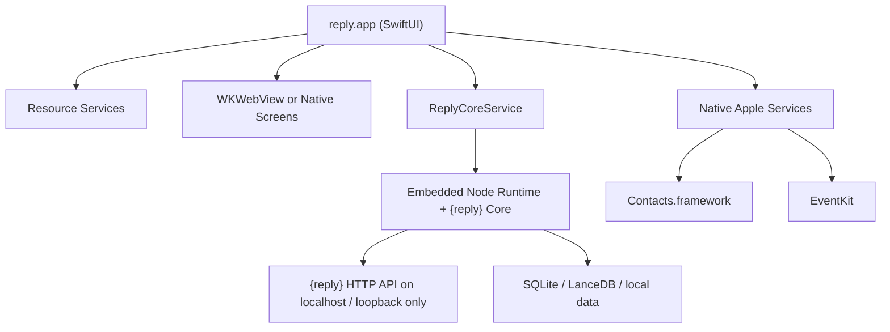

# Native macOS App Plan for `{reply}`

## Purpose

This plan defines how to turn `{reply}` from a browser-based local web app into a professional native macOS application while preserving the current product capabilities and removing the fragile process/watchdog model.

It is based on:

- the delivery patterns in `/Users/Shared/Projects/claude/calendar-agent/DEVELOPMENT.md`
- the structure and build approach in `/Users/Shared/Projects/claude/calendar-agent`
- the current `{reply}` architecture in [`/Users/moldovancsaba/Projects/reply/docs/ARCHITECTURE.md`](/Users/moldovancsaba/Projects/reply/docs/ARCHITECTURE.md)

## What We Learn From `calendar-agent`

The important lessons are not the specific product features. They are the delivery patterns:

1. Native macOS distribution should be owned by a Swift/SwiftUI app.
2. External resources must be treated as first-class managed dependencies with explicit status, recovery, and user guidance.
3. Mutable user data must live outside the app bundle so updates are safe.
4. Build, install, signing, and release flow must be explicit and repeatable.
5. Legacy runtime assumptions must be removed, not wrapped forever.

The strongest reusable pattern is:

- `Service class` for each dependency
- `Status enum` with actionable states
- `Status UI` in the app
- `ViewModel orchestration`
- `Documentation` for lifecycle and troubleshooting

That is exactly the pattern `{reply}` needs.

## What Must Change For `{reply}`

`calendar-agent` is a single-process native Swift app. `{reply}` is not.

Today `{reply}` is:

- Node hub in [`/Users/moldovancsaba/Projects/reply/chat/server.js`](/Users/moldovancsaba/Projects/reply/chat/server.js)
- managed Node worker in [`/Users/moldovancsaba/Projects/reply/chat/background-worker.js`](/Users/moldovancsaba/Projects/reply/chat/background-worker.js)
- web UI in `chat/index.html` + `chat/js/*`
- Apple integrations split across Node, AppleScript, and small Swift exporters
- local runtime scripts in `runbook/*`
- leftover menu bar surface in [`/Users/moldovancsaba/Projects/reply/tools/macos/ReplyMenubar/MenubarCore.swift`](/Users/moldovancsaba/Projects/reply/tools/macos/ReplyMenubar/MenubarCore.swift)

So the correct plan is not a blind rewrite.

The correct plan is:

1. build a native app host first
2. move system integrations and lifecycle ownership into the app
3. keep the existing {reply} core logic alive during transition
4. progressively replace brittle web-runtime seams with native modules

## Non-Negotiable Architecture Decisions

### 1. One product app owns the runtime

The macOS app becomes the control plane.

It owns:

- startup
- shutdown
- dependency checks
- permissions guidance
- update flow
- health/status UI
- future automation entrypoints

It replaces:

- ad hoc runbook control as the primary operator UX
- leftover menubar utility as a product surface
- manual “watchdog” logic as the user-facing runtime model

### 2. No custom watchdog pyramid

Do not keep:

- app launches hub
- hub restarts worker
- worker self-locks
- launchd revives hub
- extra menu app pokes services

That is the model that created instability.

Target:

- foreground app owns runtime during interactive use
- optional background helper is implemented with `SMAppService` login item, not custom launchd plumbing
- at most one owned child core process during the transition

### 3. Native app first, full backend rewrite second

For MVP delivery, `{reply}` should become a native macOS app before its Node core is fully replaced.

That means:

- the first native app release can host the existing {reply} core
- the app embeds the web UI in `WKWebView` or incrementally replaces parts with native SwiftUI views
- Apple-private integrations and lifecycle move into native code first

This is the fastest path to a stable, shippable app.

### 4. Use Apple-native APIs where they exist

For `{reply}` resources:

- Contacts: native `Contacts.framework`
- Calendar: native `EventKit`
- Notifications: native `UserNotifications`
- Login/background helper: native `ServiceManagement`
- Web shell: native `WKWebView`

But be honest about the limits:

- iMessage history still relies on reading `~/Library/Messages/chat.db`
- Apple Notes does not have a clean public read framework for this use case
- Apple Mail does not expose a general native message ingestion API suitable for replacing current local-read behavior

So “fully native” is realistic for runtime ownership and some connectors, but not for every data source.

## Resource and Dependency Management Model

This is the most important pattern to copy from `calendar-agent`.

Every external dependency gets:

- a Swift `Status` enum
- a Swift `Service` class
- detection
- status message
- recovery action
- UI surface
- troubleshooting doc section

### {reply} resource inventory

`reply.app` must manage these resources:

1. `ReplyCoreService`
- Owns the embedded {reply} core process during migration.
- Detects whether the local API is reachable.
- Starts and stops the core.

2. `OllamaService`
- Detects local Ollama.
- Lists models.
- Verifies required models for writer/judge/annotation.
- Can launch Ollama.app if installed.
- May offer install guidance, but should not silently mutate too much.

3. `IMessageAccessService`
- Checks readability of `~/Library/Messages/chat.db`.
- Reports `ready`, `blocked_by_privacy`, `missing`, `invalid_path`.
- Opens guidance for Full Disk Access.

4. `CalendarAccessService`
- Uses EventKit permission and sync state.

5. `ContactsAccessService`
- Uses Contacts permission and native export status.

6. `MailSourceService`
- Distinguishes:
  - Gmail OAuth connected
  - IMAP configured
  - Mail.app fallback available
  - unavailable

7. `NotesSourceService`
- Tracks AppleScript adapter availability and sync success.
- Long term can be replaced only if a better sanctioned source is adopted.

8. `WhatsAppGatewayService`
- Detects OpenClaw or the successor transport.
- Reports configured, linked, reachable, degraded.

9. `KnowledgeStoreService`
- Verifies {reply}’s local DB files and directories are present and writable.

10. `UpdateService`
- Owns app update state.

### Required status model

For consistency, use a common resource state family:

- `unknown`
- `checking`
- `ready`
- `degraded`
- `blocked`
- `repairRequired`
- `recovering`
- `error`

Every status must include:

- headline
- machine-readable code
- operator guidance
- last successful check
- last successful sync if applicable

## Target Product Architecture

## Phase 1 target

Native shell + embedded {reply} core:



## Phase 2 target

Native host + smaller core + more native integrations:

- Contacts sync fully native
- Calendar sync fully native
- health/preflight fully native
- app settings managed by native preferences layer
- Node core reduced to messaging, AI orchestration, ingestion logic, and data APIs

## Phase 3 target

Selective core migration:

- replace Node-only seams that exist only because of the browser runtime
- keep only what is still the best implementation

This avoids a prestige rewrite.

## Recommended Repository Shape

Add a native app workspace under the main repo:

```text
reply/
  app/
    reply-app/
      Package.swift or Xcode project
      Sources/
        App/
        Core/
        Resources/
        Services/
        Views/
        ViewModels/
        Update/
  chat/
    ...existing {reply} core...
```

Recommended app modules:

- `App/reply.swift`
- `App/AppDelegate.swift`
- `Core/ReplyCoreService.swift`
- `Core/ReplyCoreProcess.swift`
- `Services/OllamaService.swift`
- `Services/IMessageAccessService.swift`
- `Services/CalendarAccessService.swift`
- `Services/ContactsAccessService.swift`
- `Services/MailSourceService.swift`
- `Services/NotesSourceService.swift`
- `Services/WhatsAppGatewayService.swift`
- `Services/KnowledgeStoreService.swift`
- `Update/UpdateService.swift`
- `ViewModels/SystemStatusViewModel.swift`
- `Views/Dashboard/*`
- `Views/Settings/*`

## How `{reply}` Should Launch

### Development

- `reply.app` starts from Xcode or `swift run`
- app starts embedded {reply} core
- app waits for loopback health
- app loads UI

### Production

- user launches `reply.app` from `/Applications`
- app performs resource checks
- app starts core if needed
- app restores previous session
- optional login helper starts the app on login

### Background mode

If background behavior is required later:

- use `SMAppService` login item helper
- helper starts the app or a minimal core host in the user session
- do not restore custom LaunchAgent-first operations

## UI Strategy

## Short term

Keep current web UI functional inside a native shell:

- use `WKWebView`
- load local app-hosted {reply} UI
- keep existing `chat/index.html` and `chat/js/*`

This immediately gives:

- native packaging
- native permissions UX
- native distribution
- native update flow
- one app entrypoint

## Medium term

Replace the most operationally important screens with native SwiftUI:

- dashboard / system health
- sync controls
- settings
- onboarding / permissions

Keep conversation UI web-based initially if that is faster.

## Long term

Move high-value product surfaces native only if it materially improves:

- responsiveness
- maintainability
- platform integration

Do not rewrite static HTML modules just for aesthetics.

## Apple Integration Plan

## 1. Contacts

Already partially moving in the right direction:

- [`/Users/moldovancsaba/Projects/reply/chat/native/apple-contacts-export.swift`](/Users/moldovancsaba/Projects/reply/chat/native/apple-contacts-export.swift)
- [`/Users/moldovancsaba/Projects/reply/chat/ingest-contacts.js`](/Users/moldovancsaba/Projects/reply/chat/ingest-contacts.js)

Plan:

- move this exporter into the native app target
- stop spawning loose Swift scripts from Node
- expose contacts data to {reply} core through:
  - local file handoff, or
  - direct API call into core, or
  - shared SQLite ingestion table

## 2. Calendar

Already partially moving in the right direction:

- [`/Users/moldovancsaba/Projects/reply/chat/native/apple-calendar-export.swift`](/Users/moldovancsaba/Projects/reply/chat/native/apple-calendar-export.swift)
- [`/Users/moldovancsaba/Projects/reply/chat/sync-calendar.js`](/Users/moldovancsaba/Projects/reply/chat/sync-calendar.js)

Plan:

- remove AppleScript dependency from Calendar path
- move EventKit sync into native app service
- persist normalized event records into {reply}’s store

## 3. iMessage

This remains special.

There is no clean public framework for full local message history ingestion equivalent to the current SQLite strategy.

Plan:

- keep the direct SQLite read path initially
- move permission diagnostics into native app
- keep actual ingestion logic in core until a stronger replacement exists

Important:

- Full Disk Access still cannot be granted programmatically
- the app can only detect, explain, and deep-link guidance

## 4. Apple Mail

Current fallback is local Mail.app read from Node / AppleScript behavior.

Professional plan:

- primary path should be Gmail OAuth or IMAP
- Mail.app fallback can remain an adapter
- do not build product-critical logic on Mail AppleScript if IMAP/Gmail is available

## 5. Apple Notes

There is no strong public native Notes ingestion API for this exact use case.

Plan:

- keep Notes as a constrained adapter
- surface it honestly as best-effort local sync
- avoid coupling product readiness to Notes automation

## Core Process Strategy

## Phase 1

Bundle {reply} core as an owned runtime:

- bundle a known Node runtime inside the app, or
- ship a separately installed Node requirement only for internal builds

Recommendation:

- for a real product, bundle the runtime

Why:

- eliminates host-machine Node drift
- avoids “which node binary has TCC approval?” confusion
- gives repeatable startup behavior

Implementation note:

- direct distribution outside the Mac App Store is fine with a bundled runtime if signed and notarized correctly

## Phase 2

Collapse hub and worker responsibilities where sensible.

Today:

- hub in [`/Users/moldovancsaba/Projects/reply/chat/server.js`](/Users/moldovancsaba/Projects/reply/chat/server.js)
- worker in [`/Users/moldovancsaba/Projects/reply/chat/background-worker.js`](/Users/moldovancsaba/Projects/reply/chat/background-worker.js)
- extra supervision in [`/Users/moldovancsaba/Projects/reply/chat/service-manager.js`](/Users/moldovancsaba/Projects/reply/chat/service-manager.js)

Target:

- one app
- one owned {reply} core process at most
- no separate restart ladder for child pieces unless there is a proven isolation need

The hub/worker split may survive internally for a while, but the app should own it as one product runtime.

## Data and Storage

Mutable data must move into standard macOS app locations:

- `~/Library/Application Support/reply/`
- `~/Library/Caches/reply/`
- `~/Library/Logs/reply/`
- `~/Library/Preferences/...`

Do not keep production state scattered across repo-relative folders after packaging.

Required migration targets:

- `chat/chat.db`
- `chat/data/*`
- LanceDB / vector data
- logs
- sync status files
- settings

Rule:

- app bundle is immutable
- app support is mutable
- updates replace app bundle only

This is one of the main lessons from `calendar-agent`.

## Permissions Model

The native app should centralize permissions onboarding.

### Info.plist / entitlements scope

Expected declarations include at least:

- `NSContactsUsageDescription`
- `NSCalendarsUsageDescription`
- `NSAppleEventsUsageDescription` for Apple Events automation where used
- user notifications if needed

There is no plist key that solves Full Disk Access for iMessage DB access.

So the app must provide:

- a dedicated permissions screen
- live diagnostics
- exact remediation steps

## Update and Distribution Strategy

`calendar-agent` proves the value of explicit update flow, but `{reply}` should use a stronger standard for production.

## Development and internal distribution

Acceptable first step:

- GitHub Releases
- version in app bundle
- manual check menu item
- periodic check

## Production recommendation

Use `Sparkle 2`.

Why:

- industry-standard macOS app updates
- signed appcast flow
- delta-friendly upgrade path
- well-understood operational model
- better trust model than a hand-rolled updater

Target release flow:

1. build app
2. sign
3. notarize
4. staple
5. archive `.zip` or `.dmg`
6. publish release
7. publish appcast
8. app offers in-place update

The `calendar-agent` GitHub polling model is useful as a learning reference, but Sparkle is the correct long-term choice for `{reply}`.

## Build and Dependency Management

## Native app

Use:

- Swift Package Manager for app modules where practical
- Xcode project/workspace if needed for app packaging, entitlements, signing, and embedded resources

## Existing {reply} core

Keep Node dependencies in `chat/package.json` during migration.

But for packaged builds:

- app build should vendor the exact web assets and core files it needs
- packaging must not depend on a live repo checkout
- packaging must not depend on Homebrew at runtime

## Embedded resources

Bundle:

- app icons
- web assets if `WKWebView` is retained
- default templates
- static onboarding/help content

Do not bundle mutable data.

## What To Remove

These surfaces should be deprecated as product runtime mechanisms:

- [`/Users/moldovancsaba/Projects/reply/tools/macos/ReplyMenubar/MenubarCore.swift`](/Users/moldovancsaba/Projects/reply/tools/macos/ReplyMenubar/MenubarCore.swift)
- launchd-first operational assumptions in docs and scripts
- repo-path-based service assumptions
- leftover helper scripts as primary runtime UX

These may remain temporarily for development, but not as the product story.

## Recommended Delivery Phases

## Phase 0: Stabilize the contract

Goal:

- define the native app boundary before writing UI

Tasks:

- freeze the current {reply} core API contract for:
  - health
  - preflight
  - sync actions
  - suggest
  - feedback
  - settings
- define data directory contract outside the repo
- define resource status schema shared by app and core

Exit criteria:

- the app can own startup and health without scraping logs

## Phase 1: Native shell MVP

Goal:

- deliver `reply.app` as the official local product entrypoint

Tasks:

- create SwiftUI app target
- add `ReplyCoreService`
- start existing {reply} core from the app
- embed current UI with `WKWebView`
- add native health dashboard
- add permissions onboarding
- add standard app menu items:
  - About
  - Settings
  - Check for Updates
  - Restart Core
  - Open Logs

Exit criteria:

- user can install and launch `reply.app`
- app owns lifecycle
- no runbook is required for normal use

## Phase 2: Native integrations and storage migration

Goal:

- move the fragile macOS-specific seams into the app

Tasks:

- migrate Contacts exporter into app service
- migrate Calendar sync into EventKit service
- migrate settings and logs into Application Support / Preferences
- migrate startup checks into native resource services
- make app diagnostics authoritative

Exit criteria:

- health, permissions, and Apple integration readiness are native-first

## Phase 3: Runtime simplification

Goal:

- remove redundant supervision and stale tooling

Tasks:

- remove ReplyMenubar from supported runtime
- retire launchd-first run model
- collapse hub/worker orchestration where safe
- reduce Node child process count

Exit criteria:

- one clear runtime model

## Phase 4: Professional distribution

Goal:

- ship like a real Mac app

Tasks:

- signing identity setup
- notarization
- DMG/ZIP packaging
- update system
- release automation

Exit criteria:

- one-click install
- one-click update

## Phase 5: Selective UI and core migration

Goal:

- replace only the seams where native implementation is better

Candidates:

- settings
- onboarding
- health dashboard
- sync control center
- notifications
- future automations builder

Do not make this phase a mandatory blocker for app delivery.

## Immediate Implementation Recommendation

The first implementation sequence for `{reply}` should be:

1. create `app/reply-app` SwiftUI target
2. implement `ReplyCoreService`
3. move current browser UI into `WKWebView`
4. add native `SystemStatusView`
5. add native resource services for:
   - Ollama
   - iMessage access
   - Contacts
   - Calendar
   - Mail source
   - WhatsApp gateway
6. migrate Contacts and Calendar from ad hoc scripts into app-owned services
7. move app data into Application Support
8. add Sparkle-based update path
9. remove ReplyMenubar and obsolete runbook assumptions from the product path

That is the shortest credible route to a professional local macOS product.

## Risks and Constraints

1. `Mail.app` and `Notes.app` are not fully solvable with pure modern native frameworks.
2. iMessage history remains constrained by Full Disk Access and SQLite access.
3. Bundling Node increases packaging complexity, but still gives a better product than relying on host Node.
4. Mac App Store distribution is likely incompatible with the current local-data and connector model; direct signed distribution is the realistic target.

## Final Recommendation

Build `{reply}` as a native SwiftUI macOS app that owns lifecycle, permissions, health, updates, and Apple integrations, while embedding the existing {reply} core during the transition.

Do not start with a total rewrite.

Do not keep the current process/watchdog stack as the product runtime.

Do not rely on repo scripts, custom menubar tools, or launchd plumbing as the user-facing operating model.

The product should become:

- `reply.app`
- one official entrypoint
- one authoritative status surface
- one update path
- one data home
- one professional local runtime model
