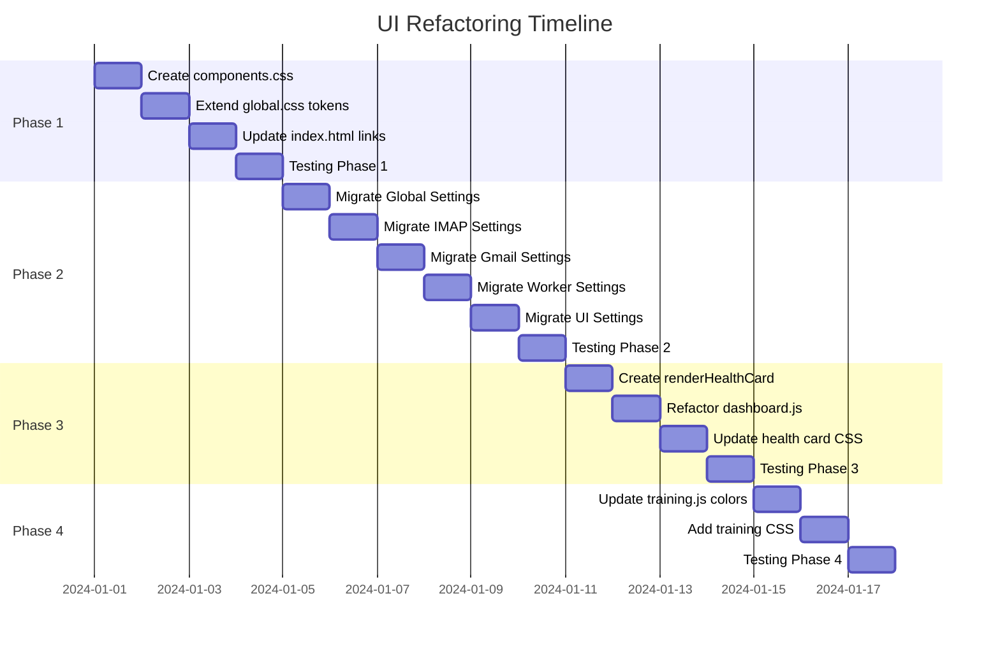

# UI Refactoring Plan for {reply} Application

## Executive Summary

This document outlines a phased approach to refactoring the UI of the {reply} application to establish a consistent design system. The current codebase has significant technical debt with **176+ inline styles** in [`index.html`](chat/index.html:1) and **hardcoded color values** throughout the JavaScript files, which bypass the existing CSS variable design system defined in [`global.css`](chat/css/global.css:1).

---

## Current State Analysis

### Design System Status

| File | CSS Variables | Inline Styles | Hardcoded Colors |
|------|---------------|---------------|------------------|
| [`global.css`](chat/css/global.css:1) | 14+ defined | 0 | 0 |
| [`app.css`](chat/css/app.css:1) | 61 `var(--)` refs | 0 | Some hardcoded |
| [`index.html`](chat/index.html:1) | Minimal usage | 176+ | 50+ `#666` alone |
| [`dashboard.js`](chat/js/dashboard.js:1) | 0 `var(--)` refs | N/A | 20+ hardcoded |
| [`training.js`](chat/js/training.js:1) | Some usage | N/A | `#d9534f` danger |

### Existing CSS Variables (global.css)

```css
/* Colors */
--bg-app: #0f0f10;
--bg-sidebar: #161618;
--bg-card: #2c2c2e;
--bg-input: #1c1c1e;
--bg-hover: #3a3a3c;
--text-primary: #ffffff;
--text-secondary: #ebebf599;
--text-tertiary: #ebebf54d;
--text-placeholder: #ebebf54d;
--primary: #0a84ff;
--primary-hover: #0077ed;
--danger: #ff453a;
--success: #30d158;
--warning: #ffd60a;
--border: #38383a;
--border-light: #48484a;

/* Spacing */
--space-xs: 4px;
--space-sm: 8px;
--space-md: 16px;
--space-lg: 24px;
--space-xl: 32px;

/* Radius */
--radius-sm: 6px;
--radius-md: 10px;
--radius-lg: 14px;
--radius-full: 9999px;
```

### Hardcoded Pattern Frequencies

| Pattern | Count | Should Be |
|---------|-------|-----------|
| `color:#666` | 47 | `var(--text-secondary)` |
| `font-size:0.8rem` | 42 | `.text-sm` utility class |
| `border:1px solid #ddd` | 37 | `var(--border)` |
| `border-radius:8px` | 36 | `var(--radius-sm)` |
| `padding:0.5rem` | 28 | `var(--space-sm)` |
| `color:#888` | 15 | `var(--text-muted)` (new) |
| `color:#999` | 12 | `var(--text-hint)` (new) |

---

## Phase 1: Foundation (Low Risk)

### Objective
Establish the foundational CSS utility classes and extend the design token system.

### 1.1 Create `components.css` File

**File:** `chat/css/components.css` (new file)

```css
/* 
 * {reply} - Component Utility Classes
 * Built on global.css design tokens
 */

/* ============================================
   Settings Form Components
   ============================================ */

.settings-field {
  margin-top: var(--space-sm);
}

.settings-label {
  font-size: 0.8rem;
  color: var(--text-secondary);
  display: block;
  margin-bottom: var(--space-xs);
}

.settings-input {
  width: 100%;
  padding: var(--space-sm);
  border: 1px solid var(--input-border, var(--border));
  border-radius: var(--radius-sm);
  background: var(--bg-input);
  color: var(--text-primary);
  font-family: inherit;
  font-size: 0.9rem;
}

.settings-input:focus {
  outline: none;
  border-color: var(--primary);
  box-shadow: 0 0 0 3px rgba(10, 132, 255, 0.25);
}

.settings-input::placeholder {
  color: var(--text-placeholder);
}

.settings-hint {
  font-size: 0.75rem;
  color: var(--text-hint, #999);
  margin-top: 6px;
}

.settings-section-title {
  font-size: 0.75rem;
  font-weight: 700;
  color: var(--text-muted, #888);
  text-transform: uppercase;
  margin-bottom: 15px;
  letter-spacing: 0.05em;
}

.settings-checkbox-label {
  font-size: 0.85rem;
  color: var(--text-secondary);
  cursor: pointer;
}

/* ============================================
   Health Card Components (Dashboard)
   ============================================ */

.health-card-header {
  display: flex;
  justify-content: space-between;
  align-items: center;
}

.health-card-actions {
  display: flex;
  gap: 6px;
  align-items: center;
}

.health-card-meta {
  font-size: 0.8rem;
  color: var(--text-muted, #888);
  margin-top: var(--space-xs);
}

.health-card-meta-overflow {
  overflow: hidden;
  text-overflow: ellipsis;
}

/* ============================================
   KPI Display Components
   ============================================ */

.kpi-value {
  font-size: 1.5rem;
  font-weight: 700;
  color: var(--text-primary);
}

.kpi-label {
  font-size: 0.8rem;
  color: var(--text-secondary);
}

/* ============================================
   Text Utility Classes
   ============================================ */

.text-xs { font-size: 0.75rem; }
.text-sm { font-size: 0.8rem; }
.text-base { font-size: 0.9rem; }
.text-lg { font-size: 1.1rem; }

.text-primary { color: var(--text-primary); }
.text-secondary { color: var(--text-secondary); }
.text-muted { color: var(--text-muted, #888); }
.text-hint { color: var(--text-hint, #999); }

/* ============================================
   Spacing Utility Classes
   ============================================ */

.mt-xs { margin-top: var(--space-xs); }
.mt-sm { margin-top: var(--space-sm); }
.mt-md { margin-top: var(--space-md); }
.mt-lg { margin-top: var(--space-lg); }

.mb-xs { margin-bottom: var(--space-xs); }
.mb-sm { margin-bottom: var(--space-sm); }
.mb-md { margin-bottom: var(--space-md); }
.mb-lg { margin-bottom: var(--space-lg); }

/* ============================================
   Layout Utility Classes
   ============================================ */

.flex { display: flex; }
.flex-col { flex-direction: column; }
.items-center { align-items: center; }
.justify-between { justify-content: space-between; }
.gap-xs { gap: var(--space-xs); }
.gap-sm { gap: var(--space-sm); }
.gap-md { gap: var(--space-md); }

/* ============================================
   Border Utility Classes
   ============================================ */

.border { border: 1px solid var(--border); }
.border-light { border: 1px solid var(--border-light); }
.rounded-sm { border-radius: var(--radius-sm); }
.rounded-md { border-radius: var(--radius-md); }
.rounded-lg { border-radius: var(--radius-lg); }
```

### 1.2 Extend `global.css` with Missing Tokens

**File:** `chat/css/global.css`

Add the following tokens to the `:root` block:

```css
:root {
  /* ... existing tokens ... */

  /* Extended Text Colors */
  --text-muted: #888;          /* For less prominent text */
  --text-hint: #999;           /* For hints and placeholders */
  
  /* Input/Form Specific */
  --input-border: #38383a;     /* Form field borders */
  --input-border-focus: var(--primary);
  
  /* Additional Spacing */
  --space-2xs: 2px;
  
  /* Additional Radii */
  --radius-input: 8px;         /* Standard input radius */
}
```

### 1.3 Update HTML to Include New Stylesheet

**File:** `chat/index.html` (head section only)

```html
<head>
  <!-- ... existing head content ... -->
  <link rel="stylesheet" href="css/global.css">
  <link rel="stylesheet" href="css/components.css">  <!-- NEW -->
  <link rel="stylesheet" href="css/app.css">
  <!-- ... -->
</head>
```

### Testing Checklist - Phase 1

- [ ] Verify `components.css` loads without errors
- [ ] Confirm new CSS variables are accessible in browser DevTools
- [ ] Test that existing styles are not affected (no visual regression)
- [ ] Validate dark mode colors meet WCAG AA contrast requirements

### Rollback Strategy - Phase 1

1. Remove `<link rel="stylesheet" href="css/components.css">` from `index.html`
2. Remove extended tokens from `global.css`
3. Delete `components.css` file

---

## Phase 2: Settings UI Migration (Medium Risk)

### Objective
Replace inline styles in the Settings page with utility classes from `components.css`.

### 2.1 Target Files

- [`chat/index.html`](chat/index.html:157-640) - Settings sections

### 2.2 Migration Pattern Examples

#### Before (Current State)

```html
<div style="margin-top: 0.5rem; border-bottom: 1px solid #eee; padding-bottom: 1.5rem; margin-bottom: 1.5rem;">
  <div style="font-size:0.75rem; font-weight:700; color:#888; text-transform:uppercase; margin-bottom: 15px;">
    Core Credentials & Security
  </div>
  <div>
    <label style="font-size:0.8rem; color:#666;">Gemini API Key</label>
    <input id="settings-global-google-api-key" type="password"
      style="width:100%; padding:0.5rem; border:1px solid #ddd; border-radius:8px;"
      placeholder="Leave blank to keep existing">
    <div style="font-size:0.75rem; color:#999; margin-top:6px;">Not set</div>
  </div>
</div>
```

#### After (Refactored)

```html
<div class="settings-section">
  <div class="settings-section-title">Core Credentials & Security</div>
  <div class="settings-field">
    <label class="settings-label" for="settings-global-google-api-key">Gemini API Key</label>
    <input id="settings-global-google-api-key" type="password"
      class="settings-input"
      placeholder="Leave blank to keep existing">
    <div class="settings-hint">Not set</div>
  </div>
</div>
```

### 2.3 Section-by-Section Migration

#### Section A: Global Settings (Lines 157-219)

| Element | Current Style | Replacement Class |
|---------|---------------|-------------------|
| Section container | `margin-top: 0.5rem; border-bottom: 1px solid #eee` | `.settings-section` |
| Section title | `font-size:0.75rem; font-weight:700; color:#888` | `.settings-section-title` |
| Labels | `font-size:0.8rem; color:#666` | `.settings-label` |
| Inputs | `width:100%; padding:0.5rem; border:1px solid #ddd; border-radius:8px` | `.settings-input` |
| Hints | `font-size:0.75rem; color:#999; margin-top:6px` | `.settings-hint` |

#### Section B: IMAP Settings (Lines 221-297)

Same pattern as Section A, with grid layouts:

```html
<!-- Before -->
<div style="display:grid; grid-template-columns: 1fr 120px; gap: 10px;">

<!-- After -->
<div class="grid grid-cols-2 gap-sm">
```

#### Section C: Gmail OAuth Settings (Lines 299-360)

#### Section D: Worker Settings (Lines 361-395)

#### Section E: Channel Bridge Settings (Lines 396-420)

#### Section F: UI Customization (Lines 421-540)

### 2.4 Additional CSS for Settings Sections

Add to `components.css`:

```css
/* Settings Page Layout */
.settings-section {
  margin-top: var(--space-sm);
  border-bottom: 1px solid var(--border);
  padding-bottom: var(--space-lg);
  margin-bottom: var(--space-lg);
}

.settings-section:last-child {
  border-bottom: none;
}

.settings-grid {
  display: grid;
  gap: var(--space-sm);
}

.settings-grid-2 {
  grid-template-columns: 1fr 1fr;
}

.settings-grid-3 {
  grid-template-columns: 1fr 1fr 1fr;
}

/* Checkbox Groups */
.settings-checkbox-group {
  display: flex;
  align-items: center;
  gap: var(--space-sm);
}

/* Button Groups */
.settings-button-group {
  display: flex;
  justify-content: flex-end;
  gap: var(--space-sm);
  margin-top: var(--space-md);
}
```

### Testing Checklist - Phase 2

- [ ] Settings page renders correctly
- [ ] All form inputs are functional
- [ ] Checkbox states persist correctly
- [ ] Color picker inputs work
- [ ] Dropdown selects function properly
- [ ] No visual regression in layout
- [ ] Responsive behavior maintained
- [ ] Dark mode colors display correctly

### Rollback Strategy - Phase 2

1. Git revert the changes to `index.html`
2. No changes to CSS files needed for rollback (classes just won't be used)

---

## Phase 3: Dashboard Cards Refactoring (Medium Risk)

### Objective
Create reusable card rendering functions and replace hardcoded colors in [`dashboard.js`](chat/js/dashboard.js:1).

### 3.1 Target Files

- [`chat/js/dashboard.js`](chat/js/dashboard.js:82-272) - Dashboard rendering

### 3.2 Create `renderHealthCard()` Function

**File:** `chat/js/dashboard.js`

```javascript
/**
 * Renders a health card with consistent styling
 * @param {Object} config - Card configuration
 * @param {string} config.title - Card title
 * @param {number|string} config.value - Main KPI value
 * @param {string} config.statusText - Status text to display
 * @param {string} [config.statusClass] - Optional status class (e.g., 'tag-online')
 * @param {Object} [config.meta] - Metadata lines
 * @param {Object} [config.actions] - Action buttons configuration
 * @returns {string} HTML string for the card
 */
function renderHealthCard(config) {
  const {
    title,
    value,
    statusText,
    statusClass = '',
    meta = [],
    actions = []
  } = config;

  const actionsHtml = actions.length > 0 ? `
    <div class="health-card-actions">
      ${actions.map(action => {
        if (action.type === 'settings') {
          return `<button type="button" class="btn-icon" data-dashboard-open-settings="${action.channel}" title="${action.title || 'Configure'}">⚙️</button>`;
        }
        if (action.type === 'sync') {
          return `<button type="button" class="btn-icon" data-dashboard-sync="${action.channel}" title="${action.title || 'Sync'}">
            ${action.icon ? `` : '🔄'}
          </button>`;
        }
        return '';
      }).join('')}
    </div>
  ` : '';

  const metaHtml = meta.map(m => {
    const overflowClass = m.overflow ? 'health-card-meta-overflow' : '';
    return `<div class="health-card-meta ${overflowClass}" ${m.title ? `title="${m.title}"` : ''}>${m.text}</div>`;
  }).join('');

  return `
    <div class="health-card">
      <div class="health-card-header">
        <h4>${title}</h4>
        ${actionsHtml}
      </div>
      <div class="health-value">${value}</div>
      <div class="health-status-tag ${statusClass}">${statusText}</div>
      ${metaHtml}
    </div>
  `;
}
```

### 3.3 Refactor Dashboard Rendering

#### Before (Current State - Lines 82-91)

```javascript
dashboard.innerHTML = `
  <div class="health-card">
    <h4>System Status</h4>
    <div class="health-value">Online</div>
    <div class="health-status-tag tag-online">● Server Running</div>
    <div style="font-size:0.8rem; color:#888; margin-top:0.5rem; display:flex; gap:12px;">
      <span>Uptime: ${uptimeHrs}h</span>
      <span>Contacts: ${health.stats?.total || 0}</span>
    </div>
  </div>
`;
```

#### After (Refactored)

```javascript
dashboard.innerHTML = `
  ${renderHealthCard({
    title: 'System Status',
    value: 'Online',
    statusText: '● Server Running',
    statusClass: 'tag-online',
    meta: [
      { text: `<span>Uptime: ${uptimeHrs}h</span> <span>Contacts: ${health.stats?.total || 0}</span>` }
    ]
  })}
  
  ${renderHealthCard({
    title: 'iMessage Sync',
    value: imessageSync.processed || 0,
    statusText: '● Messages Scanned',
    meta: [
      { text: `Last Sync: ${formatLastSync(imessageSync.lastSync)}` }
    ],
    actions: [
      { type: 'settings', channel: 'imessage', title: 'Configure iMessage' },
      { type: 'sync', channel: 'imessage', icon: '/public/imessage.svg', title: 'Sync iMessage' }
    ]
  })}
  
  ${renderHealthCard({
    title: 'WhatsApp Sync',
    value: whatsappSync.processed || 0,
    statusText: '● Messages Scanned',
    meta: [
      { text: `Last Sync: ${formatLastSync(whatsappSync.lastSync)}` }
    ],
    actions: [
      { type: 'settings', channel: 'whatsapp', title: 'Configure WhatsApp' },
      { type: 'sync', channel: 'whatsapp', icon: '/public/whatsapp.svg', title: 'Sync WhatsApp' }
    ]
  })}
  
  // ... continue for all health cards
`;
```

### 3.4 Update CSS for Health Cards

Add to `components.css`:

```css
/* Health Card Enhancements */
.health-card {
  background: var(--bg-card);
  border-radius: var(--radius-md);
  padding: var(--space-md);
  border: 1px solid var(--border);
}

.health-card h4 {
  margin: 0;
  font-size: 0.9rem;
  font-weight: 600;
  color: var(--text-primary);
}

.health-value {
  font-size: 1.5rem;
  font-weight: 700;
  color: var(--text-primary);
  margin: var(--space-sm) 0;
}

.health-status-tag {
  font-size: 0.8rem;
  color: var(--text-muted);
  padding: 4px 8px;
  border-radius: var(--radius-sm);
  background: rgba(255, 255, 255, 0.05);
  display: inline-block;
}

.health-status-tag.tag-online {
  color: var(--success);
  background: rgba(48, 209, 88, 0.1);
}
```

### Testing Checklist - Phase 3

- [ ] Dashboard loads without errors
- [ ] All health cards render correctly
- [ ] Sync buttons function properly
- [ ] Settings buttons open correct modals
- [ ] Last sync times display correctly
- [ ] Status indicators show correct colors
- [ ] No console errors in browser
- [ ] Loading state displays correctly

### Rollback Strategy - Phase 3

1. Git revert changes to `dashboard.js`
2. Remove health card styles from `components.css` if needed

---

## Phase 4: Training/Annotation Tool (Low Risk)

### Objective
Align [`training.js`](chat/js/training.js:1) styling with the main application design system.

### 4.1 Target Files

- [`chat/js/training.js`](chat/js/training.js:37-90) - Training page rendering

### 4.2 Color Replacements

| Current | Replacement | Location |
|---------|-------------|----------|
| `#d9534f` | `var(--danger)` | Decline button (line 58) |
| `red` | `var(--danger)` | Error messages (line 33) |

### 4.3 Code Changes

#### Before (Lines 56-59)

```javascript
<div style="display: flex; gap: 10px; align-items: center;">
    <button class="btn btn-primary btn-sm accept-btn">Accept (Save as Golden)</button>
    <button class="btn btn-secondary btn-sm decline-btn" style="color: #d9534f; border-color: #d9534f;">Decline (Discard)</button>
    <span style="font-size:0.8rem; color:var(--text-secondary);">(Edit text before accepting to Refine it)</span>
</div>
```

#### After

```javascript
<div class="flex gap-md items-center">
    <button class="btn btn-primary btn-sm accept-btn">Accept (Save as Golden)</button>
    <button class="btn btn-secondary btn-sm decline-btn" style="color: var(--danger); border-color: var(--danger);">Decline (Discard)</button>
    <span class="text-sm text-secondary">(Edit text before accepting to Refine it)</span>
</div>
```

### 4.4 Add Training-Specific Styles

Add to `components.css`:

```css
/* Training Page Styles */
.training-section-header {
  padding: 10px 20px;
  margin: 0;
  background: var(--bg-hover);
  border-bottom: 1px solid var(--border);
  font-weight: 600;
}

.training-item {
  padding: 15px 20px;
  border-bottom: 1px solid var(--border);
}

.training-textarea {
  width: 100%;
  min-height: 80px;
  padding: 10px;
  border-radius: var(--radius-sm);
  border: 1px solid var(--border);
  background: var(--bg-input);
  color: var(--text-primary);
  font-family: inherit;
  resize: vertical;
}

.training-textarea:focus {
  outline: none;
  border-color: var(--primary);
}

.training-meta {
  font-size: 0.8rem;
  color: var(--text-secondary);
  margin-bottom: 5px;
}

.training-content {
  font-size: 0.95rem;
  margin-bottom: 10px;
  white-space: pre-wrap;
  padding: 10px;
  background: var(--bg-hover);
  border-radius: var(--radius-sm);
}

/* Danger Button Variant */
.btn-danger-outline {
  color: var(--danger);
  border-color: var(--danger);
  background: transparent;
}

.btn-danger-outline:hover {
  background: rgba(255, 69, 58, 0.1);
}
```

### Testing Checklist - Phase 4

- [ ] Training page opens correctly
- [ ] Pending suggestions display properly
- [ ] Golden examples list renders
- [ ] Accept button functions correctly
- [ ] Decline button shows correct danger color
- [ ] Textarea editing works
- [ ] Error states display with correct colors
- [ ] No visual regression

### Rollback Strategy - Phase 4

1. Git revert changes to `training.js`
2. Remove training styles from `components.css`

---

## Implementation Timeline



---

## Risk Assessment

| Phase | Risk Level | Impact | Mitigation |
|-------|------------|--------|------------|
| Phase 1 | Low | Minimal - Only adds new files/tokens | Easy rollback, no existing code changes |
| Phase 2 | Medium | Moderate - Changes visible UI elements | Section-by-section migration, visual testing |
| Phase 3 | Medium | Moderate - Affects dashboard functionality | Test all sync/config actions |
| Phase 4 | Low | Minimal - Isolated training module | Limited scope, easy to verify |

---

## Success Metrics

1. **Inline Style Reduction**: From 176+ to < 20 inline styles
2. **CSS Variable Usage**: All color references use design tokens
3. **Code Maintainability**: Reusable component functions
4. **Consistency**: Uniform spacing, colors, and typography
5. **Performance**: No increase in render time

---

## Appendix A: Complete File Change Summary

| File | Action | Lines Changed |
|------|--------|---------------|
| `chat/css/components.css` | Create | ~200 lines |
| `chat/css/global.css` | Modify | +10 lines |
| `chat/index.html` | Modify | ~500 lines |
| `chat/js/dashboard.js` | Modify | ~150 lines |
| `chat/js/training.js` | Modify | ~20 lines |

---

## Appendix B: CSS Variable Quick Reference

```css
/* Background Colors */
--bg-app: #0f0f10;      /* App background */
--bg-sidebar: #161618;  /* Sidebar */
--bg-card: #2c2c2e;     /* Cards */
--bg-input: #1c1c1e;    /* Inputs */
--bg-hover: #3a3a3c;    /* Hover states */

/* Text Colors */
--text-primary: #ffffff;      /* High emphasis */
--text-secondary: #ebebf599;  /* Medium emphasis */
--text-tertiary: #ebebf54d;   /* Low emphasis */
--text-muted: #888;           /* Muted text (NEW) */
--text-hint: #999;            /* Hints (NEW) */

/* Accent Colors */
--primary: #0a84ff;      /* Primary action */
--danger: #ff453a;       /* Destructive */
--success: #30d158;      /* Success */
--warning: #ffd60a;      /* Warning */

/* Spacing */
--space-xs: 4px;
--space-sm: 8px;
--space-md: 16px;
--space-lg: 24px;
--space-xl: 32px;

/* Border Radius */
--radius-sm: 6px;
--radius-md: 10px;
--radius-lg: 14px;
```

---

## Appendix C: Testing Commands

```bash
# Run the application
cd chat && npm start

# Check for CSS syntax errors
npx stylelint "css/**/*.css"

# Search for remaining hardcoded colors
grep -r "color:#" chat/index.html chat/js/
grep -r "color: #" chat/index.html chat/js/

# Count inline styles (should decrease after refactoring)
grep -o 'style="' chat/index.html | wc -l
```

---

*Document Version: 1.0*  
*Created: 2024-02-24*  
*Author: Architecture Team*
