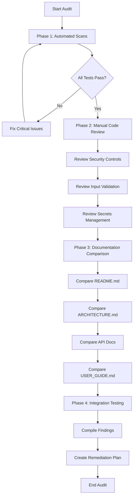

# Security & Documentation Audit Plan for {reply}

**Created**: 2026-02-23  
**Purpose**: Comprehensive bit-by-bit comparison of documentation against code implementation, with security verification at every layer.

---

## Executive Summary

This audit plan covers two major areas:
1. **Security Audit**: Verify all security controls are properly implemented and documented
2. **Documentation Audit**: Ensure all documentation accurately reflects the current codebase

---

## Part 1: Security Audit

### 1.1 Authentication & Authorization

| Audit Item | Files to Check | Documentation Reference | Verification Method |
|------------|----------------|------------------------|---------------------|
| Operator token enforcement | `chat/security-policy.js`, `chat/server.js` | `docs/HUMAN_FINAL_DECISION_POLICY.md`, `chat/.env.example` | Verify timing-safe comparison, check all sensitive routes |
| Human approval gates | `chat/server.js` (sensitive routes) | `docs/HUMAN_FINAL_DECISION_POLICY.md` | Trace each send/sync/mutation endpoint |
| Local request validation | `chat/security-policy.js` → `isLocalRequest()` | `docs/HANDOVER.md` | Verify socket.remoteAddress usage, NOT X-Forwarded-For |
| Cookie-based token auth | `chat/security-policy.js` → `parseCookieMap()`, `hasValidOperatorToken()` | Code comments | Verify URL decoding, timing-safe match |

**Code Sections to Audit:**
- [`security-policy.js`](chat/security-policy.js) lines 80-99: `timingSafeMatch()` and `hasValidOperatorToken()`
- [`server.js`](chat/server.js): All routes with `hasValidOperatorToken()` and `isHumanApproved()` checks

### 1.2 Input Validation & SQL Injection Prevention

| Audit Item | Files to Check | Known Locations | Verification Method |
|------------|----------------|-----------------|---------------------|
| SQL string escaping | `chat/vector-store.js`, `chat/channel-bridge.js` | `escapeSqlString()` usage | Grep for string-interpolated SQL |
| User input sanitization | `chat/server.js` (all POST handlers) | Request body parsing | Check for unvalidated inputs |
| AppleScript injection | `chat/sync-notes.js`, `chat/sync-imessage.js` | `execFile()` vs `exec()` | Verify argv-only execution |

**Code Sections to Audit:**
- [`server.js`](chat/server.js) line 133-135: `escapeSqlString()` function
- All `execFile()` calls in sync scripts

### 1.3 Secrets Management

| Audit Item | Files to Check | Risk Level | Verification Method |
|------------|----------------|------------|---------------------|
| `.env` gitignored | `.gitignore`, `chat/.env` | Critical | Verify no secrets in git history |
| Gmail OAuth credentials | `chat/gmail-connector.js`, `chat/settings-store.js` | High | Check clientSecret storage/masking |
| Operator token storage | `chat/.env`, `chat/data/settings.json` | High | Verify not logged or exposed in API |
| IMAP credentials | `chat/sync-imap.js`, `chat/settings-store.js` | Medium | Check password handling |

**Code Sections to Audit:**
- [`gmail-connector.js`](chat/gmail-connector.js) lines 152-161: Token refresh flow
- [`settings-store.js`](chat/settings-store.js): `maskSettingsForClient()` function

### 1.4 File Permissions & Data Protection

| Audit Item | Files to Check | Expected Mode | Verification Method |
|------------|----------------|---------------|---------------------|
| Data directory | `chat/data/` | 700 | Run `chat/security-audit.js` |
| Settings file | `chat/data/settings.json` | 600 | Verify `settings-store.js` write mode |
| Contacts database | `chat/data/contacts.db` | 600 | Verify `contact-store.js` creation mode |
| Chat database | `chat/data/chat.db` | 600 | Check creation permissions |
| Audit log | `chat/data/security_audit.jsonl` | 600 | Verify `security-policy.js` append mode |

**Code Sections to Audit:**
- [`security-audit.js`](chat/security-audit.js) lines 162-191: `applyFixes()` function
- [`security-policy.js`](chat/security-policy.js) lines 114-122: `appendSecurityAudit()` with mode 0o600

### 1.5 HTTP Security Headers

| Audit Item | Files to Check | Expected Value | Verification Method |
|------------|----------------|----------------|---------------------|
| CORS policy | `chat/server.js` | Same-origin, localhost only | Check OPTIONS handling |
| CSP headers | `chat/server.js` | 11 directives minimum | Verify all responses |
| X-Frame-Options | `chat/server.js` | DENY | Check header on all responses |
| X-Content-Type-Options | `chat/server.js` | nosniff | Check header presence |

**Code Sections to Audit:**
- [`server.js`](chat/server.js): Response header setting code (search for `X-Frame-Options`, `Content-Security-Policy`)

### 1.6 Rate Limiting

| Audit Item | Files to Check | Expected Config | Verification Method |
|------------|----------------|-----------------|---------------------|
| Rate limiter implementation | `chat/rate-limiter.js` | 30 req/min per IP | Review algorithm |
| Protected endpoints | `chat/server.js` | 12 sensitive routes | Verify middleware application |
| Retry-After header | `chat/server.js` | 429 responses | Check error responses |

**Code Sections to Audit:**
- [`rate-limiter.js`](chat/rate-limiter.js): Full implementation
- [`server.js`](chat/server.js): Rate limiter middleware on sensitive routes

### 1.7 Audit Logging

| Audit Item | Files to Check | Expected Behavior | Verification Method |
|------------|----------------|-------------------|---------------------|
| Security event logging | `chat/security-policy.js` → `appendSecurityAudit()` | All allow/deny decisions | Check log format |
| Log rotation | `chat/background-worker.js` | 5MB max | Verify rotation logic |
| Log integrity | `chat/data/security_audit.jsonl` | JSONL format | Parse and validate |

**Code Sections to Audit:**
- [`security-policy.js`](chat/security-policy.js) lines 114-122: `appendSecurityAudit()`
- [`background-worker.js`](chat/background-worker.js) lines 6-16: Log rotation

### 1.8 Channel Security

| Channel | Send Enabled | Security Controls | Documentation |
|---------|--------------|-------------------|---------------|
| iMessage | Yes | AppleScript, local-only | `docs/CHANNEL_BRIDGE.md` |
| WhatsApp | Yes | OpenClaw guard, human trigger | `docs/CHANNEL_INTEGRATION_CASE_STUDY.md` |
| Email | Yes | Gmail OAuth or Mail.app fallback | `docs/INGESTION.md` |
| Telegram | Draft only | Bridge inbound, no send | `docs/CHANNEL_BRIDGE.md` |
| Discord | Draft only | Bridge inbound, no send | `docs/CHANNEL_BRIDGE.md` |
| Signal | Draft only | Bridge inbound, no send | `docs/CHANNEL_BRIDGE.md` |
| Viber | Draft only | Bridge inbound, no send | `docs/CHANNEL_BRIDGE.md` |
| LinkedIn | Draft only | Bridge inbound, clipboard fallback | `docs/CHANNEL_BRIDGE.md` |

**Code Sections to Audit:**
- [`server.js`](chat/server.js): Channel policy enforcement in send endpoints
- [`openclaw-guard.js`](chat/openclaw-guard.js): WhatsApp DM/group policy enforcement
- [`channel-bridge.js`](chat/channel-bridge.js): Inbound event normalization

---

## Part 2: Documentation Audit

### 2.1 README.md Accuracy

| Section | Claim | Code Reference | Verification Status |
|---------|-------|----------------|---------------------|
| Prerequisites | Node.js v18+ | `chat/package.json` engines | Pending |
| Quick Start | `npm start` | `chat/package.json` scripts.start | Pending |
| Ingestion commands | `node ingest.js` | `chat/ingest.js` exists | Pending |
| Channel Policy | Send-enabled vs draft-only | `chat/server.js` send endpoints | Pending |
| Documentation links | All 10 docs exist | `docs/` directory | Pending |

### 2.2 Architecture Documentation

| Document | Audit Focus | Code Files to Compare |
|----------|-------------|----------------------|
| `docs/ARCHITECTURE.md` | Component diagram accuracy | All core files |
| `docs/ARCHITECTURE.md` | LanceDB schema | `chat/vector-store.js` |
| `docs/ARCHITECTURE.md` | Background worker description | `chat/background-worker.js` |
| `docs/ARCHITECTURE.md` | Settings storage path | `chat/settings-store.js` |

**Specific Checks:**
- [ ] Mermaid diagram matches actual data flow
- [ ] Component list is complete
- [ ] Technology versions are current

### 2.3 API Documentation Completeness

| Endpoint | Documented Location | Code Implementation | Verification |
|----------|--------------------|--------------------|--------------|
| `POST /api/send-imessage` | `docs/HUMAN_FINAL_DECISION_POLICY.md` | `chat/server.js` | Pending |
| `POST /api/send-whatsapp` | `docs/CHANNEL_INTEGRATION_CASE_STUDY.md` | `chat/server.js` | Pending |
| `POST /api/send-email` | `docs/INGESTION.md` | `chat/server.js` | Pending |
| `POST /api/channel-bridge/inbound` | `docs/CHANNEL_BRIDGE.md` | `chat/server.js` | Pending |
| `GET /api/conversations` | `docs/APP_NAVIGATION.md` | `chat/server.js` | Pending |
| `GET /api/thread` | Implied in UI docs | `chat/server.js` | Pending |
| `POST /api/kyc` | `docs/HANDOVER.md` | `chat/routes/kyc.js` | Pending |
| `GET /api/settings` | `docs/ARCHITECTURE.md` | `chat/server.js` | Pending |
| `POST /api/settings` | `docs/ARCHITECTURE.md` | `chat/server.js` | Pending |
| `GET /api/gmail/*` | `docs/INGESTION.md` | `chat/server.js`, `chat/gmail-connector.js` | Pending |

### 2.4 User Guide Accuracy

| Section | Document Claim | Code/UI Verification | Status |
|---------|---------------|---------------------|--------|
| Start/Stop | `Launch Reply.command` | File exists, check behavior | Pending |
| UI Map - Sidebar | Contact list, dashboard icon | `chat/index.html`, `chat/js/contacts.js` | Pending |
| UI Map - Dashboard | Health cards, sync icons | `chat/js/dashboard.js` | Pending |
| UI Map - Feed | Composer, channel dropdown | `chat/js/messages.js` | Pending |
| UI Map - Settings | Full page, gear icon | `chat/js/settings.js` | Pending |
| Gmail OAuth | Redirect URIs | `chat/gmail-connector.js` | Pending |
| WhatsApp | Prerequisites, behavior | `chat/sync-whatsapp.js` | Pending |

### 2.5 Handover Document Currency

| Section | Last Updated | Verification Needed |
|---------|-------------|---------------------|
| Current Priorities | 2026-02-22 | Check board status matches |
| Active Issues | Listed #s | Verify each issue status |
| Recent Shipped | 2026-02-18 | Verify features exist |
| Known Quirks | WhatsApp flaky | Still accurate? |
| Quick Verification | Commands listed | Run each command |

### 2.6 Coding Standards Compliance

| Standard | Document Location | Code Verification |
|----------|------------------|-------------------|
| No secrets in commits | `docs/CODING_STANDARDS.md` | Check git history |
| JSDoc on exports | `docs/CODING_STANDARDS.md` | Grep for `@param`, `@returns` |
| ES6 async/await | `docs/CODING_STANDARDS.md` | Check for callback patterns |
| No console.log spam | `docs/CODING_STANDARDS.md` | Grep for `console.log` |
| Bounded caches | `docs/CODING_STANDARDS.md` | Check Map/Set usage |

### 2.7 Security Policy Documentation

| Policy | Document | Code Implementation |
|--------|----------|---------------------|
| Human approval required | `docs/HUMAN_FINAL_DECISION_POLICY.md` | `chat/security-policy.js` |
| Local-only writes | `docs/HUMAN_FINAL_DECISION_POLICY.md` | `isLocalRequest()` |
| Audit trail | `docs/HUMAN_FINAL_DECISION_POLICY.md` | `appendSecurityAudit()` |
| Deny-by-default | `docs/HUMAN_FINAL_DECISION_POLICY.md` | Route middleware |

---

## Part 3: Audit Execution Checklist

### Phase 1: Automated Security Scans

```bash
# Run existing security audit
cd chat && node security-audit.js

# Run tests
npm test

# Run linter
npm run lint

# Check for vulnerabilities
npm audit
```

### Phase 2: Manual Code Review

- [ ] Review all sensitive routes in `server.js`
- [ ] Verify all SQL queries use parameterized or escaped values
- [ ] Check all `execFile` calls for proper argv usage
- [ ] Verify no hardcoded secrets in any file
- [ ] Review all cookie/header handling for security

### Phase 3: Documentation Comparison

- [ ] Compare each doc section against actual code
- [ ] Identify outdated or missing documentation
- [ ] Check for undocumented features
- [ ] Verify all code references in docs are accurate

### Phase 4: Integration Testing

- [ ] Test each send endpoint with missing token
- [ ] Test each send endpoint with wrong token
- [ ] Test rate limiting on sensitive endpoints
- [ ] Test CORS blocking on cross-origin requests
- [ ] Verify audit log entries for all security events

---

## Part 4: Findings Template

### Security Findings

| ID | Severity | Category | Description | File:Line | Remediation |
|----|----------|----------|-------------|-----------|-------------|
| SEC-001 | | | | | |

### Documentation Findings

| ID | Type | Document | Section | Issue | Correction Needed |
|----|------|----------|---------|-------|-------------------|
| DOC-001 | | | | | |

---

## Part 5: Audit Workflow Diagram



---

## Part 6: Detailed File-by-File Audit Checklist

### Core Server Files

#### `chat/server.js` (120,649 chars - largest file)
- [ ] All POST endpoints have auth checks
- [ ] All send endpoints require human approval
- [ ] Rate limiting applied to sensitive routes
- [ ] CORS headers on all responses
- [ ] CSP headers on all responses
- [ ] No hardcoded secrets
- [ ] Proper error handling without leaking info
- [ ] SQL queries use `escapeSqlString()`
- [ ] File paths are validated

#### `chat/security-policy.js`
- [ ] `getSecurityPolicy()` defaults are secure
- [ ] `isLocalRequest()` uses socket address
- [ ] `hasValidOperatorToken()` uses timing-safe comparison
- [ ] `isHumanApproved()` checks all approval signals
- [ ] `appendSecurityAudit()` writes with correct mode

#### `chat/security-audit.js`
- [ ] All critical checks implemented
- [ ] Fix mode works correctly
- [ ] Exit codes are appropriate

#### `chat/contact-store.js`
- [ ] SQL queries are safe
- [ ] File permissions on DB creation
- [ ] Proper error handling

#### `chat/background-worker.js`
- [ ] Bounded caches implemented
- [ ] Error recovery in poll loop
- [ ] Log rotation works
- [ ] PID file management correct

### Connector Files

#### `chat/gmail-connector.js`
- [ ] OAuth flow is secure
- [ ] Tokens stored securely
- [ ] No credentials logged
- [ ] Proper error handling

#### `chat/sync-imap.js`
- [ ] Credentials handled securely
- [ ] No password logging

#### `chat/sync-whatsapp.js`
- [ ] UI automation safe
- [ ] No message injection

#### `chat/channel-bridge.js`
- [ ] Input validation on all fields
- [ ] SQL escaping applied
- [ ] Idempotency works

### Frontend Files

#### `chat/js/api.js`
- [ ] Token included in requests
- [ ] Human approval header sent
- [ ] No secrets in localStorage key names

#### `chat/js/settings.js`
- [ ] Client secret masking works
- [ ] No secrets exposed to UI

#### `chat/js/kyc.js`
- [ ] Token handling correct

---

## Part 7: Remediation Priority Matrix

| Priority | Criteria | Action Timeline |
|----------|----------|-----------------|
| P0 - Critical | Security vulnerability with active exploit risk | Immediate |
| P1 - High | Security weakness or major doc inaccuracy | Within sprint |
| P2 - Medium | Minor security improvement or doc update | Next sprint |
| P3 - Low | Cosmetic or nice-to-have | Backlog |

---

## Appendix A: Environment Variables Reference

From `chat/.env.example`:
- `GOOGLE_API_KEY` - Gemini API key
- `PORT` - Server port
- `REPLY_OPERATOR_TOKEN` - Security token
- `REPLY_SECURITY_REQUIRE_OPERATOR_TOKEN` - Enable token enforcement
- `REPLY_SECURITY_LOCAL_WRITES_ONLY` - Restrict writes to localhost
- `REPLY_SECURITY_REQUIRE_HUMAN_APPROVAL` - Require human approval
- `REPLY_WHATSAPP_SEND_TRANSPORT` - WhatsApp transport method
- `REPLY_WHATSAPP_ALLOW_OPENCLAW_SEND` - Enable OpenClaw
- `REPLY_WHATSAPP_DESKTOP_FALLBACK_ON_OPENCLAW_FAILURE` - Fallback behavior
- `REPLY_CHANNEL_BRIDGE_ENDPOINT` - Bridge endpoint URL

---

## Appendix B: Test Coverage Reference

Current tests in `chat/test/`:
- `security-policy.test.js` - 20 tests
- `rate-limiter.test.js` - 6 tests

**Total: 26 tests passing**

---

## Appendix C: Documentation Index

| Document | Purpose | Last Verified |
|----------|---------|---------------|
| `README.md` | Quick start guide | Pending |
| `docs/ARCHITECTURE.md` | System overview | Pending |
| `docs/APP_NAVIGATION.md` | UI/code map | Pending |
| `docs/INGESTION.md` | Data sync guide | Pending |
| `docs/CHANNEL_BRIDGE.md` | Bridge API docs | Pending |
| `docs/CHANNEL_INTEGRATION_CASE_STUDY.md` | Integration pattern | Pending |
| `docs/LEARNINGS.md` | Technical decisions | Pending |
| `docs/CODING_STANDARDS.md` | Developer guidelines | Pending |
| `docs/HUMAN_FINAL_DECISION_POLICY.md` | Security policy | Pending |
| `docs/HANDOVER.md` | Developer handover | Pending |
| `docs/HANDOVER_LINKEDIN_IMPORT.md` | LinkedIn specifics | Pending |
| `docs/RELEASE_NOTES.md` | Changelog | Pending |
| `docs/USER_GUIDE.md` | End-user guide | Pending |
| `docs/DEFINITION_OF_DONE.md` | DoD checklist | Pending |
| `docs/BRAIN_DUMP.md` | Operational state | Pending |
| `docs/PROJECT_MANAGEMENT.md` | Board rules | Pending |
| `docs/DEPENDENCY_MAP.md` | Issue dependencies | Pending |
| `docs/BACKLOG_PRIORITIZATION.md` | Priority matrix | Pending |
| `docs/SPRINT_PLAN_2W.md` | Sprint plan | Pending |

---

**End of Audit Plan**
